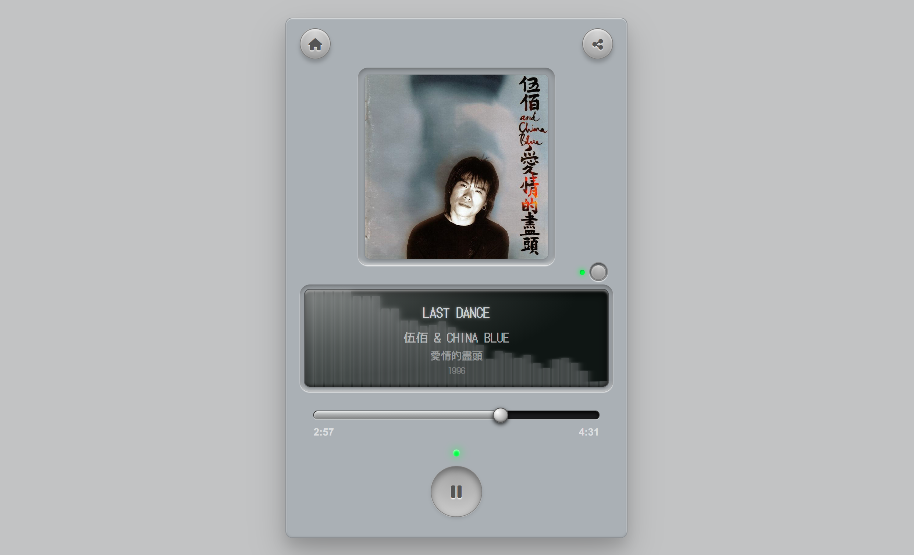

# 🎵 Music Share Player (網頁音樂分享播放器)

這是一個具有**高度擬真質感 (Skeuomorphic Design)**與**復古黑膠唱片機風格**的網頁版音樂播放器。
它不僅支援直接播放網路上的音樂連結，還提供密碼保護的「本機檔案上傳」功能，是您用來對外分享自建音樂庫、或是與朋友分享單曲的絕佳工具！



---

## ✨ 核心特色與功能

*   **🎛️ 復古擬真介面**：擁有精心設計的實體按鈕點擊音效、LCD 螢幕觸控音效，以及黑膠唱片旋轉動畫，帶來極致的沈浸式聽覺體驗。
*   **🌈 動態主題色彩**：系統會自動擷取歌曲專輯封面的主要顏色，並動態替換整個播放器的按鈕與光暈主題色（可透過面板開關自由切換）。
*   **📊 視覺化音樂頻譜**：內建 Web Audio API，能在 LCD 螢幕上即時顯示隨著音樂節奏跳動的綠色 EQ 頻譜圖。
    *   *(註：為確保 iOS/Android 手機端能完美支援背景播放，行動裝置上會自動切換為平滑的模擬頻譜動畫。)*
*   **🏷️ 智慧標籤解析**：搭載強大的前後端雙軌解析引擎 (`music-metadata`)，自動抓取音檔內的 ID3 標籤（包含歌名、歌手、專輯封面），首創極速讀取機制。
*   **📱 手機鎖定畫面支援**：整合 `MediaSession API`，即使將瀏覽器縮小或鎖定螢幕，也能在手機鎖定畫面上看到專輯封面、歌名，並使用原生播放控制。
*   **🔒 安全與優化機制**：
    *   **本機秒傳**：支援大檔案 MD5 驗證與進度條顯示。
    *   **無縫登入**：輸入一次上傳密碼後，系統會透過 Cookie 記錄狀態（保留 30 天），之後進入本機上傳頁面無需重複輸入。
    *   **網路韌性**：支援斷線續傳功能，遭遇網路不穩時自動重試最高 5 次，並在徹底失敗時優雅退回首頁。
    *   **後端防護**：內建防禦 SSRF（伺服器端請求偽造）與目錄穿越 (Path Traversal) 的安全防線，並會定時自動清理過期的暫存檔與 180 天舊快取。

---

## 🚀 快速開始

### 1. 透過 URL 參數直接分享
您只需要提供音樂檔案的直接連結，透過 URL 參數傳遞給網頁，系統就會自動讀取音樂檔案內的標籤資訊（包含歌名、歌手、專輯封面），任何人點開網址即可直接播放：
```text
http://[您的服務器位址]/?link=[歌曲直鏈]
```

### 2. 本機上傳部署 (需 Node.js)
如果您希望使用「本機檔案上傳」功能，請確保您在伺服器上執行了隨附的 Express 後端服務：

1. **安裝依賴**：
   在專案目錄下執行：
   ```bash
   npm install
   ```
2. **設定環境變數**：
   在根目錄建立一個 `.env` 檔案，並設定您的上傳專用密碼：
   ```env
   UPLOAD_PASSWORD=您的超級安全密碼
   ```
3. **啟動伺服器**：
   ```bash
   node server.js
   ```
4. **開始使用**：
   打開瀏覽器前往 `http://localhost:8000`，點擊「本機上傳」並輸入密碼，即可開始上傳您的本機音樂！

---

## 🛠️ 技術堆疊

*   **前端**：原生 HTML5 / CSS3 / Vanilla JavaScript。無框架，極致輕量與快速。
*   **後端**：Node.js + Express + Multer (處理音樂檔案上傳)。
*   **音訊處理**：Web Audio API (頻譜分析)、MediaSession API。
*   **元資料解析**：music-metadata (主核心) / jsmediatags (備用)。
*   **安全與效能**：dotenv (環境變數)、MD5 快取驗證、斷線續傳機制。

---

## 📝 授權條款
本專案為開源專案，歡迎自由 Fork、修改與分享！
